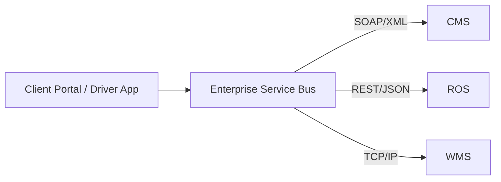
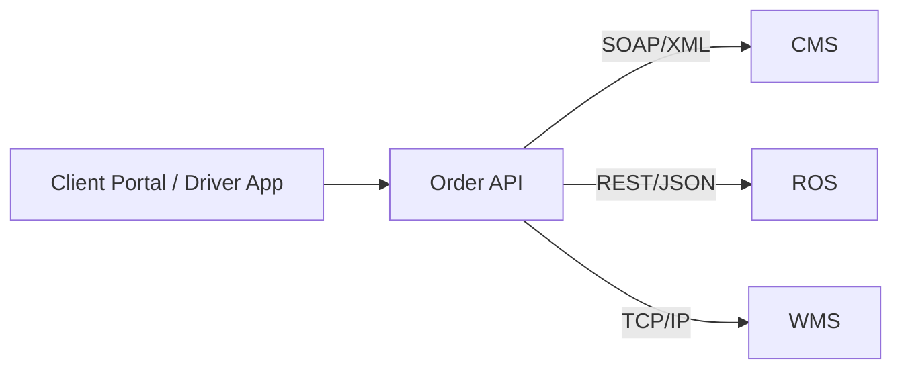
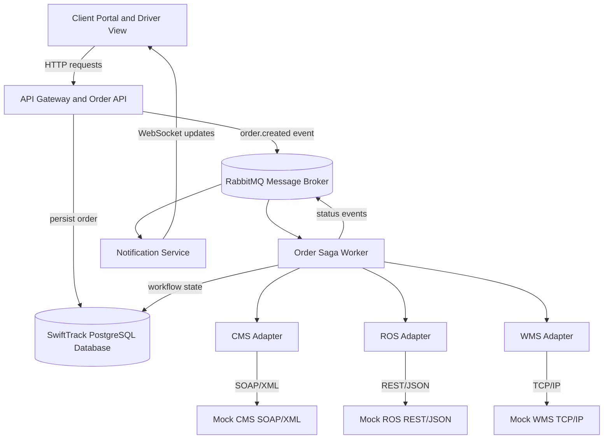

# SwiftTrack Architecture Alternatives

## 1. Architectural Drivers

The assignment scenario imposes six design pressures:

1. Integrate three incompatible systems: SOAP/XML CMS, REST/JSON ROS, and TCP/IP WMS.
2. Accept high volumes of orders without keeping the client portal blocked.
3. Ensure an accepted order is not lost if a back-end system is temporarily unavailable.
4. Keep multi-system order processing consistent when one step fails.
5. Send real-time status updates to clients and drivers.
6. Use open-source technologies and support future scaling.

The alternatives below are evaluated against these drivers.

## 2. Alternative A: Centralised ESB / SOA Architecture

### How it works

The Enterprise Service Bus is the central integration engine. All client requests and messages pass through it. The ESB performs routing, data transformation, protocol conversion, security checks, error handling, and service orchestration.

### Strengths

- Very strong fit for legacy and heterogeneous system integration.
- Central place to implement SOAP, REST, and TCP/IP adapters.
- Centralised monitoring, routing, and security policy enforcement.
- Closely aligns with traditional SOA and Enterprise Application Integration concepts.
- Makes the business process visible in one orchestration layer.

### Weaknesses

- The ESB can become a bottleneck under heavy traffic.
- It is a potential single point of failure unless it is replicated.
- Business logic can accumulate inside the bus and become difficult to maintain.
- A full enterprise ESB product adds setup complexity beyond what a short prototype needs.

## 3. Alternative B: Direct Synchronous Microservices

### How it works

The client calls a single Order API. The API directly calls CMS, WMS, and ROS during the same client request, then returns a response after all operations have finished.

### Strengths

- The simplest initial implementation.
- Fewer infrastructure components.
- The request path is easy to follow while all systems are healthy.
- Each external system can still be hidden behind an adapter.

### Weaknesses

- The client waits while every back-end system responds.
- A slow or failed ROS, CMS, or WMS can make the portal appear unavailable.
- High-volume traffic directly reaches every downstream system.
- Recovery from partial completion is difficult: CMS might succeed while ROS fails.
- The design is tightly coupled in time: all services must be available at the same moment.

## 4. Selected Architecture: Event-Driven Hybrid Integration

The final architecture combines the integration strengths of an ESB with the resilience and independent scaling associated with microservices. Instead of a heavyweight ESB product, it uses an application-level orchestration service, a message broker, and dedicated adapters.

### How the normal flow works

1. The client submits an order to the API Gateway.
2. The API validates the request and saves it as `RECEIVED` in the SwiftTrack database.
3. The API publishes an `order.created` event to RabbitMQ.
4. The API immediately replies to the client. It does not wait for the external systems.
5. The Saga Worker consumes the event and coordinates the CMS, WMS, and ROS steps.
6. Each adapter translates the internal order model into the target system's protocol.
7. The worker records each completed step and publishes a status event.
8. The Notification Service pushes that status to connected clients using WebSockets.

## 5. Why This Architecture Was Chosen

| Requirement | Final architecture response |
|---|---|
| SOAP, REST, and TCP/IP integration | Dedicated adapters isolate protocol and data-format conversion. |
| High order volume | RabbitMQ buffers bursts; workers can be increased independently. |
| No lost accepted orders | The API persists the order before acknowledging it; durable messages and retry logic continue processing. |
| Partial failures | The orchestrated Saga records completed steps, retries failures, and avoids repeating successful steps. |
| Real-time tracking | Status events are published and sent to the browser over WebSocket. |
| Scalability | API, worker, notification, and adapter components can be replicated separately. |
| Security | The API Gateway is the single external entry point for authentication, validation, and authorisation. |
| Open-source constraint | FastAPI, RabbitMQ, PostgreSQL, Docker, and React are open-source. |

## 6. Architectural and Integration Patterns

| Pattern | Use in SwiftTrack |
|---|---|
| API Gateway / Facade | Presents one clean HTTP API to client and driver applications. |
| Adapter | Translates internal order data into SOAP/XML, REST/JSON, and TCP/IP messages. |
| Publish/Subscribe | Delivers order-status events to the notification component and interested clients. |
| Message Queue | Decouples client order submission from long-running back-end work. |
| Saga Orchestration | Coordinates the order steps across systems without a global database transaction. |
| Retry and Dead-Letter Queue | Handles temporary failures and preserves messages that need manual attention. |
| Idempotent Consumer | Prevents duplicate work when a message is delivered again. |
| Circuit Breaker | Stops repeated calls to a persistently unavailable external service. |
| Observer | WebSocket clients observe changing order status. |

## 7. Key Trade-off: Eventual Consistency

In the selected design, an order can briefly be `CMS_CONFIRMED` while it is not yet `ROUTE_PLANNED`. This is called eventual consistency: the systems do not become consistent at the exact same instant, but the Saga continues until they reach a known final state.

This trade-off is appropriate because delivery-route generation and warehouse registration are long-running distributed operations. Forcing the client to wait for a global transaction would reduce availability and make recovery harder.

## 8. Prototype Simplifications

- The API Gateway and Order API will be one deployable service.
- The Saga orchestrator and the adapter calls will be one background worker service.
- The notification component may run alongside the API service for simplicity.
- CMS, ROS, and WMS are mocks because SwiftTrack does not own the real systems.
- Docker Compose will run the prototype locally; Kubernetes is discussed as a production scaling option rather than implemented.

## 9. Architecture Decision

**Decision:** Build an event-driven hybrid middleware architecture using a client-facing API Gateway, PostgreSQL order persistence, RabbitMQ messaging, an orchestrated Saga worker, protocol adapters, and WebSocket notifications.

**Reason:** It directly addresses every scenario challenge while remaining small enough to implement and demonstrate within the assignment timeframe.
