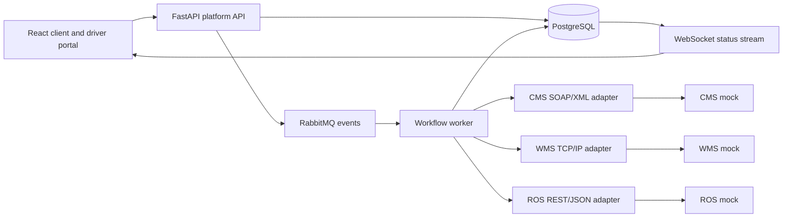

# SwiftTrack Middleware Prototype — Final Technical Report

## 1. Executive summary

SwiftTrack is a middleware prototype for a logistics order workflow. It accepts an order once, persists it, processes it asynchronously, translates requests across three different integration styles, records the complete lifecycle, and exposes live progress to a browser client.

The prototype integrates:

- a CMS mock using SOAP/XML;
- a ROS mock using REST/JSON;
- a WMS mock using newline-framed TCP/IP;
- PostgreSQL for durable order state and history;
- RabbitMQ for asynchronous processing, retry, and dead-letter handling;
- a React/Vite client and driver demonstration interface.

The implementation is designed to be started locally with Docker Compose and demonstrated through the API, browser portal, and RabbitMQ Management UI.

## 2. Problem and requirements

The system must coordinate a delivery order across systems that do not share a protocol or response format. A successful order must reach the following states in order:

```text
RECEIVED -> PROCESSING -> CMS_CONFIRMED -> WMS_ACCEPTED -> ROUTE_PLANNED
  -> READY_FOR_DELIVERY -> OUT_FOR_DELIVERY -> DELIVERED
```

The design also supports `PROCESSING_FAILED` for integration failures and `DELIVERY_FAILED` for driver-reported delivery failures.

The important functional requirements are:

1. Persist the order before acknowledging it.
2. Prevent duplicate creation when the same idempotency key is retried.
3. Process the integration workflow asynchronously.
4. Translate between SOAP/XML, REST/JSON, and TCP/IP messages.
5. Preserve successful work when a later integration step fails.
6. Retry transient failures and route exhausted messages to a DLQ.
7. Provide live status updates without a page refresh.
8. Allow a driver to accept, deliver, or fail an order.

## 3. Architecture and design decision

### Selected architecture

SwiftTrack uses an event-driven hybrid architecture. The API is responsible for the synchronous command boundary and durable acceptance. RabbitMQ and a worker own the long-running integration workflow.



### Alternatives considered

| Alternative | Benefit | Limitation | Decision |
|---|---|---|---|
| Centralised ESB/SOA | Strong central governance and routing | More infrastructure for this prototype | Not selected |
| Direct synchronous microservice calls | Simple request flow | Couples the API to slow or unavailable systems | Not selected |
| Event-driven hybrid | Durable acceptance, asynchronous work, retries, and adapter boundaries | Requires eventual-consistency handling | Selected |

The selected design fits the requirement that the API remain responsive while CMS, WMS, and ROS work is performed in the background.

## 4. Technology and deployment

| Component | Responsibility | Local endpoint |
|---|---|---|
| React/Vite frontend | Client and driver demonstration UI | `http://localhost:5173` |
| FastAPI API | Order commands, queries, and WebSocket stream | `http://localhost:8000` |
| PostgreSQL 16 | Durable order state and history | `localhost:5432` |
| RabbitMQ 3.13 | Events, retries, and DLQ | `localhost:5672`, Management UI `localhost:15672` |
| CMS mock | SOAP/XML boundary | `http://localhost:8001` |
| ROS mock | REST/JSON route planning boundary | `http://localhost:8002` |
| WMS mock | TCP/IP package registration boundary | `localhost:9003` |

All services are defined in `/swifttrack/docker-compose.yml`. The Compose file also defines health checks and service dependencies so the complete local environment can be started reproducibly.

## 5. Protocol translation and integration contracts

The platform does not expose the external protocols directly to the browser. Each adapter converts an internal order representation into the format required by one external system and normalises the result back into workflow state.

| System | External protocol | Example request/response | Adapter responsibility |
|---|---|---|---|
| CMS | SOAP/XML over HTTP | `create_order` returns `CREATED:<order-id>` | Build XML/SOAP request, call the service, interpret the response |
| ROS | REST/JSON over HTTP | Route response contains vehicle, stops, and estimated minutes | Build JSON route request and convert the route into `route_summary` |
| WMS | TCP/IP, UTF-8, newline-framed | `REGISTER|<order-id>|<package-id>|<address>` and `ACK|...` | Send the framed command and parse the acknowledgement |

The internal event published by the API is intentionally small:

```json
{
  "event_id": "<unique-event-id>",
  "event_type": "order.created",
  "occurred_at": "<UTC-timestamp>",
  "order_id": "<order-uuid>"
}
```

This keeps the message contract stable while the worker retrieves the current order from PostgreSQL.

## 6. Persistence, idempotency, and lifecycle state

An order is inserted into PostgreSQL with `RECEIVED` and a history entry before the API publishes the processing event. The `Idempotency-Key` is stored under a unique constraint. A repeated request with the same key returns the original order instead of creating a second one.

The order stores client and recipient data, current status and history, route summary, failure details, completion flags for CMS/WMS/ROS, and timestamps. The completion flags allow the worker to resume from the failed integration step. If ROS fails after CMS and WMS succeed, a retry does not repeat the completed CMS and WMS work.

## 7. Asynchronous processing and resilience

The normal processing path is:

1. `POST /api/orders` validates and persists the order.
2. The API publishes `order.created` to the durable `swifttrack.events` exchange.
3. The API returns the order identifier to the caller.
4. The worker consumes the message from `swifttrack.order-processing`.
5. The worker calls CMS, WMS, and ROS in sequence and commits each status transition.
6. The worker acknowledges the message only after the workflow completes.

The resilience path uses a retry queue with a five-second TTL. A failed message is republished with an incremented retry count. After the configured retry limit, it is rejected without requeue and routed to `swifttrack.order-processing.dlq`.

The observed ROS failure demonstration showed:

- CMS completed once;
- WMS completed once;
- ROS returned HTTP 503 on the initial attempt and three retries;
- the final order state was `PROCESSING_FAILED`;
- `failure_step` was `ROS`;
- one message was visible in the dead-letter queue.

This demonstrates partial-progress preservation and bounded failure handling.

## 8. Real-time and delivery interface

The browser page is one intentionally simplified demonstration surface with two clearly labelled areas:

- `CLIENT PORTAL`: create an order or look up an existing UUID;
- `DRIVER VIEW`: accept an order, mark it delivered, or report a delivery failure.

It is not a production role-separated application. There is no authentication or role-based access control in this prototype. The same page is used to make the end-to-end middleware workflow easy to demonstrate.

After an order is selected, the client opens `ws://localhost:8000/ws/orders/<order-id>`. The WebSocket receives an immediate snapshot and subsequent status snapshots. The UI shows the current status, lifecycle progress, detailed history, connection state, and driver actions when the order reaches `READY_FOR_DELIVERY`.

Delivery commands are separate from integration processing:

- `POST /api/orders/{id}/dispatch` changes `READY_FOR_DELIVERY` to `OUT_FOR_DELIVERY`;
- `POST /api/orders/{id}/delivery` changes `OUT_FOR_DELIVERY` to `DELIVERED` or `DELIVERY_FAILED`.

Final delivery states are treated as immutable.

## 9. Verification evidence

The evidence set was captured from the running local system. The screenshots are kept outside the repository unless they are explicitly copied into the submission package.

| ID | Evidence | Demonstrates |
|---|---|---|
| E01 | `Screenshot 2026-08-15 at 19.22.52.png` | Docker Compose starts all eight services; infrastructure is healthy and API/frontend/worker are running |
| E02 | `Screenshot 2026-08-15 at 19.28.29.png` | New order accepted with idempotency key `evidence-order-shan-001`; status is `RECEIVED` |
| E03 | `Screenshot 2026-08-15 at 19.32.06.png`; `Screenshot 2026-08-15 at 19.32.27.png` | Same order reaches `READY_FOR_DELIVERY` through CMS, WMS, and ROS with a route summary |
| E04 | `Screenshot 2026-08-15 at 19.37.00.png`; `Screenshot 2026-08-15 at 19.37.19.png` | Repeating the same idempotency key returns the same UUID and does not create a duplicate |
| E05 | `Screenshot 2026-08-15 at 20.02.09.png`; `Screenshot 2026-08-15 at 20.02.26.png`; `Screenshot 2026-08-15 at 20.03.33.png` | WebSocket connection, live status progression, and UI state at `READY_FOR_DELIVERY` |
| E06 | Terminal response captured during the session for UUID `deeac335-fd09-47e2-8257-ec630ffc7ad6` | ROS HTTP 503, preserved CMS/WMS completion, three retries, and terminal `PROCESSING_FAILED` |
| E07 | `Screenshot 2026-08-15 at 21.33.54.png`; `Screenshot 2026-08-15 at 21.34.08.png` | RabbitMQ DLQ contains one ready message and is bound from `swifttrack.events` with `order.processing.dead` |
| E08 | `Screenshot 2026-08-15 at 20.18.27.png` | Existing E05 order transitions to `OUT_FOR_DELIVERY` after driver acceptance |
| E09 | `Screenshot 2026-08-15 at 20.18.53.png` | Existing E05 order transitions to `DELIVERY_FAILED` with a recorded reason |
| E10 | `Screenshot 2026-08-15 at 21.50.39.png` and [GitHub repository](https://github.com/alexmps2003/MW2) | Source repository, `main` branch, documentation, frontend, services, scripts, and Compose files |
| E11 | `Screenshot 2026-08-15 at 21.58.09.png` | A normal-flow order reaches `DELIVERED`; the UI shows the complete lifecycle and “Delivery completed” |

The evidence log provides the UUIDs, keys, endpoints, and interpretation for each item: [evidence-log.md](evidence-log.md).

## 10. Reproduction and demonstration

From the `swifttrack` directory:

```bash
cp .env.example .env
docker compose up -d --build
```

Then open:

- API health: `http://localhost:8000/health`
- browser portal: `http://localhost:5173`
- RabbitMQ Management: `http://localhost:15672`

The complete ordered demonstration, including normal flow, idempotency, ROS failure, DLQ inspection, and driver actions, is documented in [final-demo-script.md](final-demo-script.md).

For a slower visual demonstration, set `WORKFLOW_DEMO_DELAY_SECONDS=3` in `.env` and recreate the API/worker containers as described in the demo script. The delay is for demonstration only and does not change the workflow design.

## 11. Security and reproducibility notes

- `.env` is local configuration and must not be committed.
- `.env.example` contains development-only placeholder credentials.
- The external systems are local mocks; no production credentials or external services are required.
- The current prototype has no authentication, authorisation, TLS, or production secret-management layer.
- The repository can be started from a clean machine with Docker and Docker Compose using the documented command.
- The current GitHub repository is public; confirm that this visibility is acceptable for the module submission before sharing the link outside the group.

## 12. Limitations and future work

The prototype intentionally focuses on middleware behaviour rather than production operations. Suitable next steps are:

1. Add authentication and separate client, driver, and operator roles.
2. Replace mock integrations with secured, contract-tested external clients.
3. Add automated unit, integration, and end-to-end tests to the repository.
4. Add structured logs, metrics, tracing, and an operator retry/replay screen.
5. Move WebSocket fan-out to a shared event source for multi-instance deployment.
6. Add stronger circuit-breaking and timeout policies around external systems.
7. Add schema/version management for integration and event contracts.

## 13. Conclusion

SwiftTrack demonstrates the required middleware concerns in one reproducible workflow: protocol translation, durable asynchronous processing, idempotency, partial-progress recovery, retry/DLQ handling, live status updates, and driver delivery outcomes. The implementation and captured evidence together provide the basis for the technical report and live demonstration.
