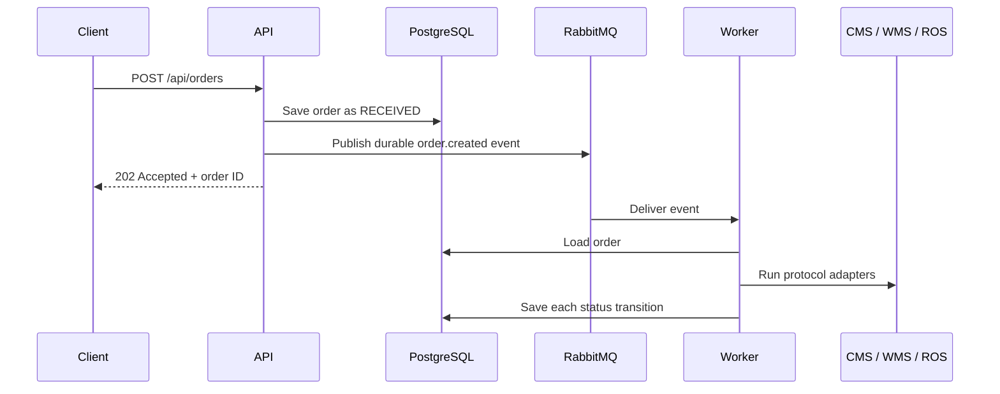

# Phase 6: Event-Driven Order Processing

## Goal

Phase 5 proved that SwiftTrack can translate one order into SOAP/XML, TCP/IP, and REST/JSON calls. Phase 6 changes the normal order path so the API does not synchronously call those systems.



## Message contract

The API publishes JSON to the durable `swifttrack.events` topic exchange:

```json
{
  "event_id": "unique event UUID",
  "event_type": "order.created",
  "occurred_at": "UTC timestamp",
  "order_id": "order UUID"
}
```

The worker retrieves the complete order from PostgreSQL using `order_id`. The database remains the source of truth; the event is a durable instruction to process that order.

## RabbitMQ topology

| Component | Purpose |
|---|---|
| `swifttrack.events` | Durable topic exchange for SwiftTrack events. |
| `swifttrack.order-processing` | Durable queue consumed by the worker. |
| `swifttrack.order-processing.dlq` | Dead-letter queue for messages the worker cannot process. |
| `order.created` | Routing key for a new-order event. |

The worker acknowledges a message only after the workflow finishes. A failed message is negatively acknowledged without requeueing, so RabbitMQ moves it to the dead-letter queue. Retry policies will be added in the resilience phase.

## Why the workflow is safe to resume

The `cms_done`, `wms_done`, and `ros_done` flags are checked by `run_order_workflow`. If the worker fails after CMS has succeeded, a later delivery can continue from WMS rather than creating a second CMS order. The mock systems also return idempotent responses for repeated requests.

## Phase 5 versus Phase 6

`POST /api/orders/{id}/integration-preview` remains as a synchronous teaching/demo endpoint. It is useful for showing the three adapters directly. Normal order creation now uses RabbitMQ and the worker.

## Owner verification checkpoint

Run these commands manually from the project directory:

```bash
docker compose up -d --build api worker
docker compose ps
```

Create a new order using a new idempotency key, then query it again after the worker has processed the event. The expected lifecycle is:

```text
RECEIVED -> PROCESSING -> CMS_CONFIRMED -> WMS_ACCEPTED
          -> ROUTE_PLANNED -> READY_FOR_DELIVERY
```

RabbitMQ's management interface at `http://localhost:15672` should show the processing queue. The queue should normally return to zero after the worker acknowledges a successful event.
