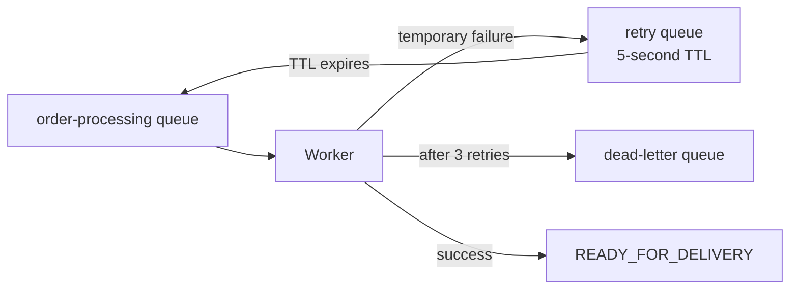

# Phase 7: Resilience and Recovery

## Goal

Phase 7 demonstrates what happens when ROS is unavailable after an order has already been accepted. The API remains available, the worker retries the event through RabbitMQ, and a permanently failing event is preserved in a dead-letter queue.

## Retry flow



The worker does not use an unbounded `requeue=true` loop. It adds an `x-retry-count` header, publishes the message to the delayed retry queue, and acknowledges the original delivery. After the configured maximum of three retries, the event is published to `swifttrack.order-processing.dlq`.

## Safe partial-failure behaviour

The worker records each successful step before moving to the next one. If ROS fails after CMS and WMS succeed:

- `cms_done` remains `true`.
- `wms_done` remains `true`.
- `ros_done` remains `false`.
- The order records `failure_step=ROS` and `status=PROCESSING_FAILED` between attempts.
- A later retry resumes at ROS instead of repeating CMS and WMS.
- If ROS recovers before the retry limit, the order reaches `READY_FOR_DELIVERY`.
- If ROS remains unavailable, the event reaches the DLQ and the order remains visibly failed for operator attention.

## Controlled demonstration

Use a new idempotency key for this demonstration. First enable the ROS failure switch:

```bash
curl -X PUT http://localhost:8002/admin/failure \
  -H "Content-Type: application/json" \
  -d '{"enabled":true,"delay_seconds":0.2}'
```

Create an order through the normal API, then query it while the worker retries. Leave the failure enabled long enough to observe the final failed state and the DLQ in RabbitMQ. The default timing is one initial attempt followed by three retries, five seconds apart.

To allow a later retry to recover, disable the ROS failure switch:

```bash
curl -X PUT http://localhost:8002/admin/failure \
  -H "Content-Type: application/json" \
  -d '{"enabled":false,"delay_seconds":0}'
```

The exact recovery timing depends on when the switch is disabled relative to the retry queue's TTL.

## RabbitMQ evidence

Open `http://localhost:15672` and select **Queues and Streams**. The relevant queues are:

| Queue | Expected use |
|---|---|
| `swifttrack.order-processing` | Normal worker input; usually returns to zero after success. |
| `swifttrack.order-processing.retry` | Holds failed events for five seconds before returning them to processing. |
| `swifttrack.order-processing.dlq` | Holds events that exhausted the retry limit. |

This evidence demonstrates that the middleware does not silently lose accepted orders or hide integration failures.
