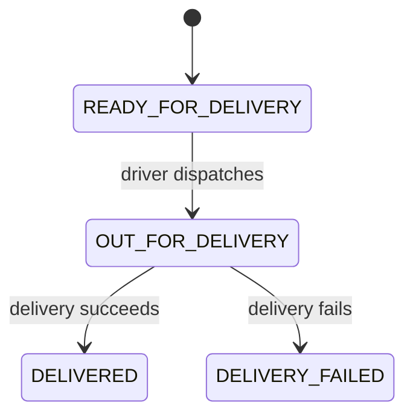

# Phase 8: Driver Delivery Lifecycle

## Goal

Phase 8 adds the driver-facing part of the order lifecycle. A driver can accept a ready order for delivery and then record either a successful delivery or a delivery failure with a reason.



## API contract

### Dispatch an order

```http
POST /api/orders/{order_id}/dispatch
```

Only `READY_FOR_DELIVERY` orders can be dispatched. Repeating the request while the order is already `OUT_FOR_DELIVERY` is idempotent.

### Record a delivery outcome

```http
POST /api/orders/{order_id}/delivery
Content-Type: application/json
```

Successful delivery:

```json
{
  "outcome": "DELIVERED"
}
```

Failed delivery:

```json
{
  "outcome": "DELIVERY_FAILED",
  "reason": "Recipient was unavailable"
}
```

A reason is required for `DELIVERY_FAILED`. Only `OUT_FOR_DELIVERY` orders can be completed, and a final delivery state cannot be changed afterwards.

## Why this belongs at the API boundary

The driver interface should not write database statuses directly. It sends a business action to the API, which validates the current state, records the transition, and appends an auditable history entry. This protects the lifecycle from invalid actions such as marking a newly received order as delivered.

## Owner verification checkpoint

First use an order that has already reached `READY_FOR_DELIVERY`, then run:

```bash
curl -X POST http://localhost:8000/api/orders/<ready-order-id>/dispatch
```

Then record a successful delivery:

```bash
curl -X POST http://localhost:8000/api/orders/<ready-order-id>/delivery \
  -H "Content-Type: application/json" \
  -d '{"outcome":"DELIVERED"}'
```

The response should contain `OUT_FOR_DELIVERY` after dispatch and `DELIVERED` after completion, with both transitions present in `history`.

For the failure branch, use another ready order, dispatch it, and run:

```bash
curl -X POST http://localhost:8000/api/orders/<ready-order-id>/delivery \
  -H "Content-Type: application/json" \
  -d '{"outcome":"DELIVERY_FAILED","reason":"Recipient was unavailable"}'
```

The final response should contain `DELIVERY_FAILED`, `failure_step=DELIVERY`, and the supplied reason.
